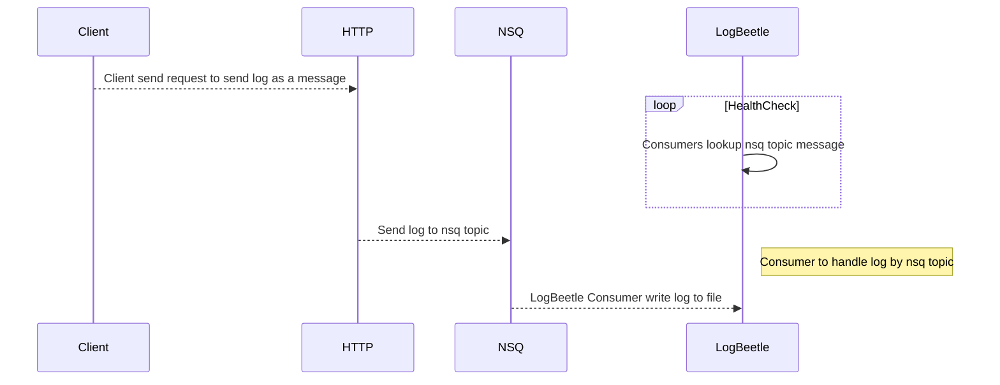

# LogBeetle


[](https://github.com/reggiepy/LogBeetle)
[](https://github.com/reggiepy/LogBeetle)
[](https://goreportcard.com/report/github.com/reggiepy/LogBeetle)

## Installation

```bash
git clone https://github.com/reggiepy/LogBeetle.git
cd LogBeetle
go mod tidy
```

## Usage

```bash
go run cmd/log-writer/main.go
```

生成swagger UI
```bash
swag init -g cmd/log-writer/main.go
```

build cli
```bash
go run build github.com/reggiepy/LogBeetle/cmd/cli
```

编译cli
```bash
cd cmd\cli
go run .
go build .
```

编译cli
```bash
go run build github.com/reggiepy/LogBeetle/cmd/cli
```
## Architecture



